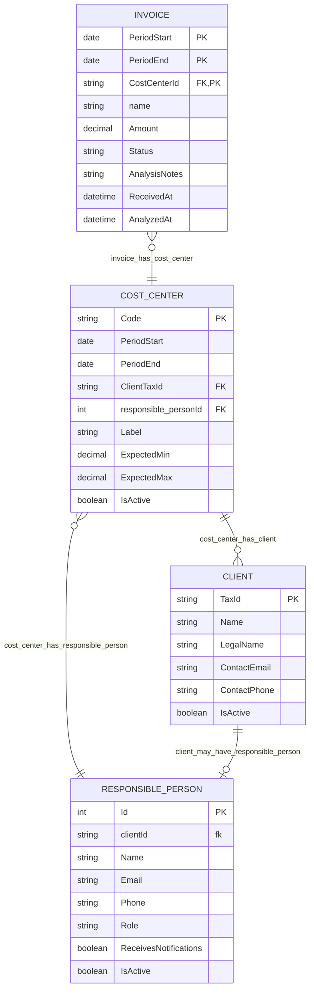

# Data Model

## Overview

This document describes the core entities and their relationships within the Invoice Management Tool system. The data model is designed to support multi-tenant invoice tracking with hierarchical organization and notification capabilities.

## Entity Relationships

### Core Entities

#### Client (Cliente)
- **Purpose:** Represents a company or organization being billed for telecom services
- **Key Attributes:** Tax ID (CNPJ), Name, Contact Information
- **Relationships:** Has one or many Cost Centers

#### Cost Center (Centro de Custo)
- **Purpose:** Organizational unit for grouping invoices and budget tracking
- **Key Attributes:** Code, Name, Expected Invoice Range
- **Relationships:**
  - Belongs to exactly one Client
  - Has 0 or many Responsible Persons

#### Responsible Person (Pessoa Responsável)
- **Purpose:** Individual who receives notifications and manages cost centers
- **Key Attributes:** Name, Email, Phone, Role
- **Relationships:**
  - Can be responsible for multiple Clients
  - Can be responsible for multiple Cost Centers

#### Invoice (Fatura)
- **Purpose:** Telecom bill requiring tracking and analysis
- **Key Attributes:** Invoice Number, Amount, Period, Status, Analysis Notes
- **Relationships:** Belongs to exactly one Cost Center

## Relationship Diagram



## Business Rules

### Client Rules
- Tax ID must be unique and valid (CNPJ or CPF format)
- Cannot be deleted if has associated cost centers
- Deactivation cascades to all cost centers

### Cost Center Rules
- Code must be unique within a client
- Must have at least one active responsible person
- Budget limit and expected ranges are optional but recommended
- Cannot be deleted if has associated invoices

### Responsible Person Rules
- Email must be unique and valid format
- Can be associated with multiple clients through cost centers
- Notification preference can be toggled per person
- Deactivation removes from notification list but preserves history

### Invoice Rules
- Invoice number must be unique within a cost center
- Status transitions follow workflow: Expected → Received → Under Analysis → Analyzed → Approved
- Amount validation against cost center's expected range triggers notifications
- Analysis notes required when status is "Analyzed"

## Junction Tables

### CostCenterResponsibles
```sql
CREATE TABLE CostCenterResponsibles (
    CostCenterId INT NOT NULL,
    ResponsiblePersonId INT NOT NULL,
    AssignedAt DATETIME NOT NULL,
    IsPrimary BOOLEAN DEFAULT FALSE,
    PRIMARY KEY (CostCenterId, ResponsiblePersonId),
    FOREIGN KEY (CostCenterId) REFERENCES CostCenters(Id),
    FOREIGN KEY (ResponsiblePersonId) REFERENCES ResponsiblePersons(Id)
);
```

## Status Workflows

### Invoice Status Flow
```
Expected → Received → Under Analysis → Analyzed → Approved
                ↓                          ↓
            Disputed                   Rejected
```

### Notification Triggers
- **On Received**: Notify if amount exceeds expected range
- **On Under Analysis**: Notify responsible persons of cost center
- **On Analyzed**: Notify with analysis results
- **On Approved/Rejected**: Final status notification

## Data Integrity Constraints

1. **Referential Integrity**
   - Foreign keys with appropriate cascade rules
   - Soft deletes for audit trail preservation

2. **Business Logic Constraints**
   - Invoice period must not overlap within same cost center
   - Expected ranges: Min must be less than Max
   - Budget limit must be positive value

3. **Temporal Constraints**
   - Invoice received date cannot be before period end
   - Analysis date must be after received date

## Performance Considerations

### Indexes
- Tax ID (Client)
- Cost Center Code + Client
- Invoice Number + Cost Center
- Email (Responsible Person)
- Status + Cost Center (Invoice)

### Partitioning Strategy
- Invoice table by period (monthly partitions)
- Archive completed invoices after 24 months
